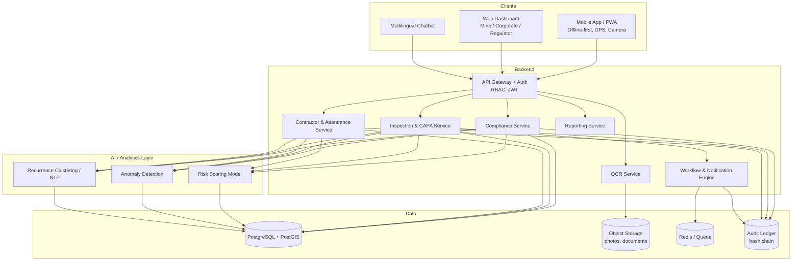
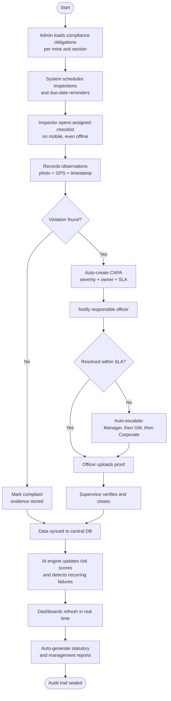
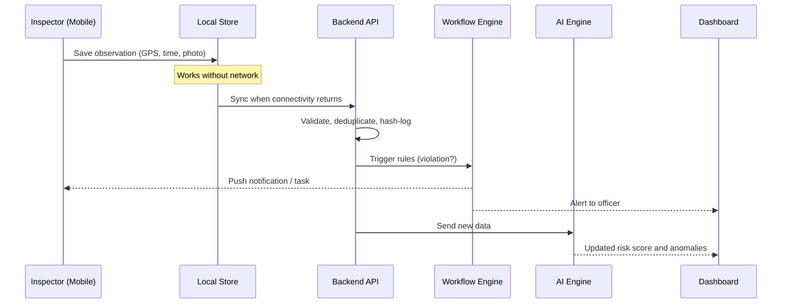

# CoalGov AI: Smart Governance & Compliance Monitoring for Coal Mines

> Smart India Hackathon 2026 | PS **SIH26024** | Ministry of Coal (Coal India Limited) | Category: Software | Theme: Smart Automation

A centralized, AI-enabled platform that brings statutory compliance, inspections, contractor management, field reporting and regulatory reporting for coal mines into one digital ecosystem, with real-time dashboards, automated workflows and predictive risk alerts.

---

## 1. Problem Summary

Coal mining spans many subsidiaries, mines, contractors and regulators. Governance activities (compliance tracking, inspections, safety observations, production and environment reporting, attendance, contracts, grievances) live in spreadsheets, paper files and disconnected systems. This causes:

- Data inconsistency and duplicate records
- Delayed reporting and decision-making
- Compliance gaps and weak field-level monitoring
- Limited transparency and accountability

## 2. Our Solution

One platform with a web dashboard and an offline-first mobile app, backed by an AI/analytics engine and an automated workflow engine.

| PS Requirement | How CoalGov AI addresses it |
|---|---|
| Track statutory compliance (safety, environment, production, labour) | Compliance Registry: obligations mapped per mine with due dates, owners and status |
| Real-time monitoring of inspections, violations, corrective actions | Inspection and CAPA (Corrective and Preventive Action) module with live status |
| AI to find high-risk areas and recurring failures | Risk Scoring, Recurrence Detection, Anomaly Detection |
| Geo-tagged, time-stamped mobile reporting | Android/PWA app with GPS, timestamp, photo evidence, offline sync |
| Dashboards for mine, corporate and regulator | Role-based dashboards (Mine, Subsidiary, Corporate, Regulator) |
| Alerts, reminders, reports, escalations | Rule-based workflow engine and auto-generated statutory reports |
| Minimize paperwork | OCR document digitization, digital approvals, e-signatures |
| Scalable across mines and subsidiaries | Multi-tenant architecture (Company > Subsidiary > Mine > Section) |
| Optional: GIS, blockchain, multilingual | GIS map layer, hash-anchored audit trail, Hindi/regional-language chatbot |

## 3. Key Features

1. **Compliance Registry**: statutory obligations (e.g., Mines Act, environmental clearances, labour rules) with owners, deadlines and evidence.
2. **Inspection Management**: schedule, checklist-based inspections, observations, violation logging.
3. **CAPA Tracking**: corrective actions with SLA timers, reassignments and closure verification.
4. **Geo-tagged Mobile App**: inspections, safety observations, incidents, attendance; works offline and syncs later.
5. **AI Risk Engine**: risk heatmaps per mine/section, recurring-violation clustering, anomaly detection on production/safety data, predictive alerts.
6. **Workflow Automation**: alerts, reminders, multi-level escalation, digital approvals.
7. **Contractor Management**: contract records, worker and attendance verification, compliance score per contractor.
8. **Grievance Handling**: submit, route, track and close grievances.
9. **OCR Digitization**: convert scanned permits, reports and registers into searchable structured data.
10. **GIS Mapping**: mine boundaries, incident/violation locations, risk layers.
11. **Secure Audit Trail**: tamper-evident logs (hash chaining, optional blockchain anchoring).
12. **Multilingual Assistant**: conversational queries such as "Show pending safety violations in Mine X" in English/Hindi.
13. **Auto Reports**: one-click statutory and management reports (PDF/Excel).

## 4. System Architecture



## 5. End-to-End Workflow

### 5.1 Core compliance and inspection loop



### 5.2 Offline field reporting sequence



### 5.3 Workflow by role

| Role | Main actions |
|---|---|
| Field Inspector / Supervisor | Do inspections, log observations, incidents, attendance |
| Mine Manager | Review dashboard, assign and close CAPAs, approve reports |
| Contractor | Submit worker lists, compliance documents, respond to violations |
| Subsidiary / Corporate Management | Compare mines, view risk heatmaps, track escalations |
| Regulator / Auditor | Read-only access to compliance status and audit trail |
| Admin | Configure obligations, checklists, rules, users |

## 6. AI / Analytics Design

| Capability | Approach | Output |
|---|---|---|
| Risk scoring | Gradient boosting (XGBoost/LightGBM) on violation history, severity, overdue CAPAs, incidents | Risk score per mine/section/contractor |
| Anomaly detection | Isolation Forest / time-series (Prophet, z-score) on production, attendance, safety metrics | Flags for unusual patterns |
| Recurring failure detection | Text embeddings + clustering on observation text | Repeated issue groups and root-cause hints |
| Predictive alerts | Forecast probability of missed deadlines | Early warnings before breach |
| OCR | Tesseract / PaddleOCR + field extraction | Structured data from scanned documents |
| Chat assistant | LLM with text-to-query over approved views | Natural-language answers in Hindi/English |

> For the prototype, use synthetic data plus public datasets where available, and clearly label it as such.

## 7. Tech Stack

| Layer | Choice |
|---|---|
| Web frontend | React + TypeScript, Tailwind, Recharts, Leaflet/MapLibre |
| Mobile | React Native or PWA with IndexedDB/SQLite offline sync |
| Backend | FastAPI (Python) or Node.js (NestJS) |
| Database | PostgreSQL + PostGIS |
| Queue / cache | Redis + Celery/BullMQ |
| Storage | MinIO / S3-compatible |
| AI/ML | scikit-learn, XGBoost, Prophet, sentence-transformers |
| OCR | Tesseract / PaddleOCR |
| Auth | Keycloak or JWT with RBAC |
| Audit | Hash-chained log; optional Hyperledger/Polygon anchoring |
| DevOps | Docker, GitHub Actions, on-prem / NIC-cloud friendly |

## 8. Data Model (simplified)

```
Organization > Subsidiary > Mine > Section
User(role) | Contractor | Worker
ComplianceObligation(mine, category, frequency, due_date, owner)
Inspection(mine, section, inspector, checklist, status)
Observation(inspection, text, severity, geo, timestamp, media)
CAPA(observation, owner, sla, status, escalation_level)
Attendance(worker, mine, geo, timestamp)
Grievance(source, category, status)
Document(type, ocr_text, extracted_fields)
RiskScore(entity, score, factors, computed_at)
AuditLog(actor, action, payload_hash, prev_hash, timestamp)
```

## 9. Security and Governance

- Role-based and mine-level access control
- Encryption in transit (TLS) and at rest
- Tamper-evident audit trail (hash chaining)
- Data residency in India; deployable on-premises for Coal India
- Consent and privacy controls for worker data (attendance/geo)

## 10. Implementation Plan

**MVP (hackathon demo)**
1. Auth + role-based dashboards
2. Compliance registry + inspection checklist
3. Mobile geo-tagged observation with offline sync
4. Auto CAPA creation, reminders and escalation
5. Risk heatmap + one anomaly/recurrence model
6. PDF compliance report

**Phase 2**: OCR digitization, contractor module, grievance module, GIS layers, chatbot.
**Phase 3**: Blockchain anchoring, integration with existing CIL/CMPDI systems, predictive maintenance links, national roll-out.

## 11. Expected Impact

| Metric | Expected outcome |
|---|---|
| Compliance reporting time | Significantly reduced through automation |
| Paperwork | Largely eliminated through digital forms and OCR |
| Violation closure | Faster via SLA tracking and escalation |
| Transparency | Real-time visibility for management and regulators |
| Scalability | New mines onboarded via configuration, not code |

## 12. Getting Started

```bash
# Clone
git clone https://github.com/<your-team>/coalgov-ai.git
cd coalgov-ai

# Start everything
docker compose up --build

# Seed demo data
docker compose exec backend python scripts/seed_demo.py
```

| Service | URL |
|---|---|
| Web dashboard | http://localhost:3000 |
| API docs | http://localhost:8000/docs |
| Mobile (PWA) | http://localhost:3000/m |

Demo logins are listed in `docs/demo_users.md`.

## 13. Suggested Folder Structure

```
coalgov-ai/
├── backend/          # APIs, services, workflow engine
├── ml/               # models, training notebooks, inference
├── web/              # React dashboard
├── mobile/           # PWA / React Native app
├── ocr/              # document digitization service
├── infra/            # docker, CI/CD
├── docs/             # architecture, demo script, PPT
└── README.md
```

## 14. Team

| Name | Role |
|---|---|
| _Add_ | Team Lead |
| _Add_ | Backend |
| _Add_ | Frontend / Mobile |
| _Add_ | AI/ML |
| _Add_ | UI/UX and Presentation |

## 15. License

MIT (or as required by SIH guidelines).
